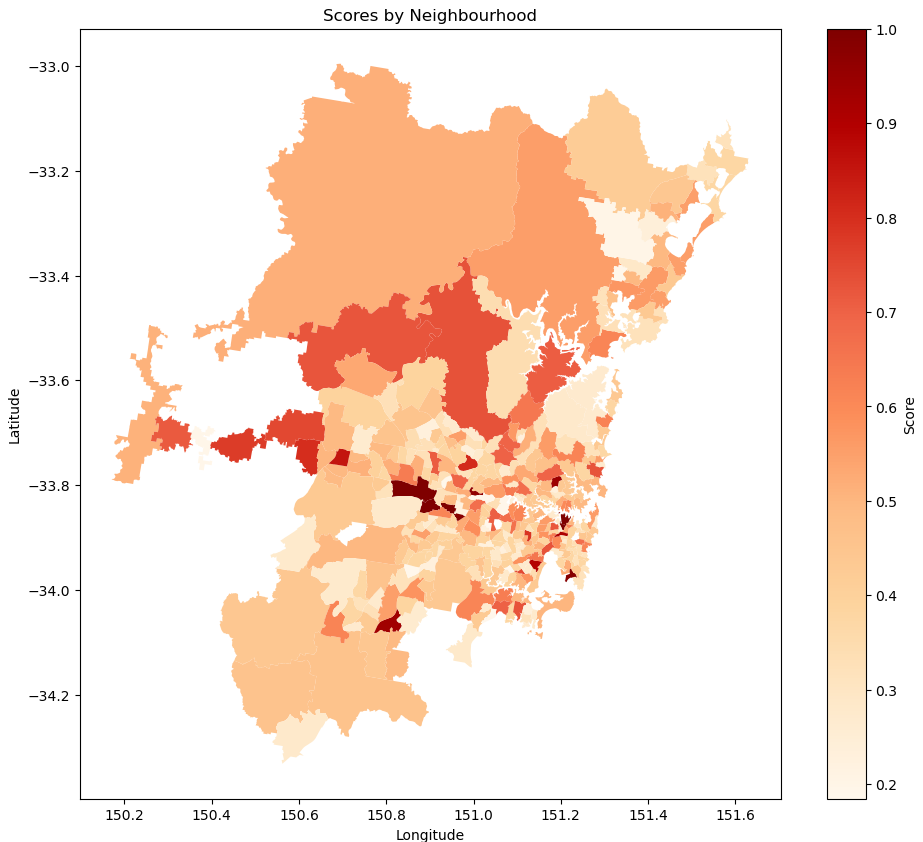

# Greater Sydney Analysis - Data Analysis Project

## Project Overview
This project focuses on analyzing various geographical regions within Greater Sydney to calculate a "bustling" metric for each area. The goal is to integrate multiple datasets of different formats and compute a score that quantifies how busy different districts in Sydney are.

## Datasets
- `catchments/`: Shapefiles and related data for different catchment areas (future, primary, secondary).
- `SA2_2021_AUST_SHP_GDA2020/`: Shapefiles for SA2 regions within Australia.
- `Businesses.csv`: Data on the number of businesses by industry and SA2 region.
- `cre.json`: Configuration file for data processing.
- `Greater_Sydney_Analysis.ipynb`: Jupyter Notebook documenting the entire data analysis process.
- `hospitals.csv`: Data on hospital locations.
- `Income.csv`: Income statistics by SA2 region.
- `PollingPlaces2019.csv`: Data on polling place locations from the 2019 Federal election.
- `Population.csv`: Population estimates by SA2 region and age range.
- `Stops.txt`: Public transport stop locations in GTFS format.
- `sydneybeaches.csv`: Data on Sydney beaches.

## Analysis Steps

### Data Import and Cleaning
- Imported various datasets using Python libraries.
- Cleaned and preprocessed data to handle missing and anomalous values.

### Data Processing and Integration
- Created and managed database schema in PostgreSQL.
- Imported cleaned datasets into the database.
- Used SQL queries to create views and aggregate data:

### Data Analysis and Visualization
- Computed a "bustling" score for each SA2 region using the formula below, where $S$ is the sigmoid function and $z$ is the normalised z-score.
$$
\text{Score} = S(z_{\text{business}} + z_{\text{stops}} + z_{\text{polls}} + z_{\text{schools}})
$$
- Extended the scoring function by incorporating additional datasets.
- Visualized the results using interactive graphs and map overlays.
- Analyzed the correlation between the bustling score and the median income of each region.

  

